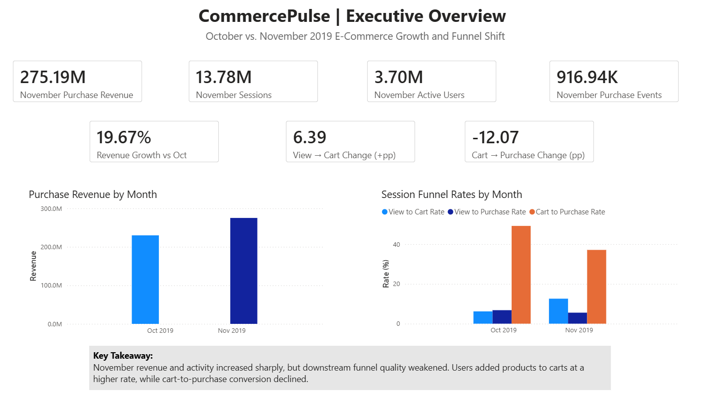
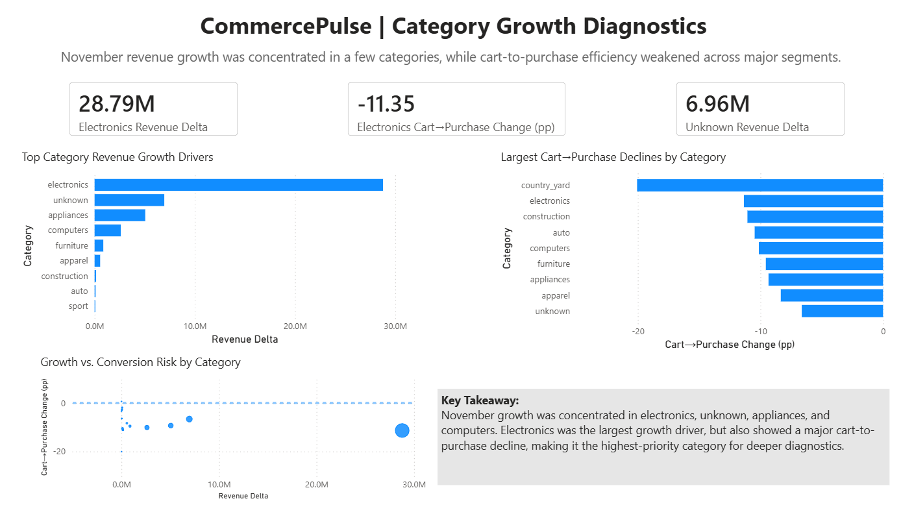
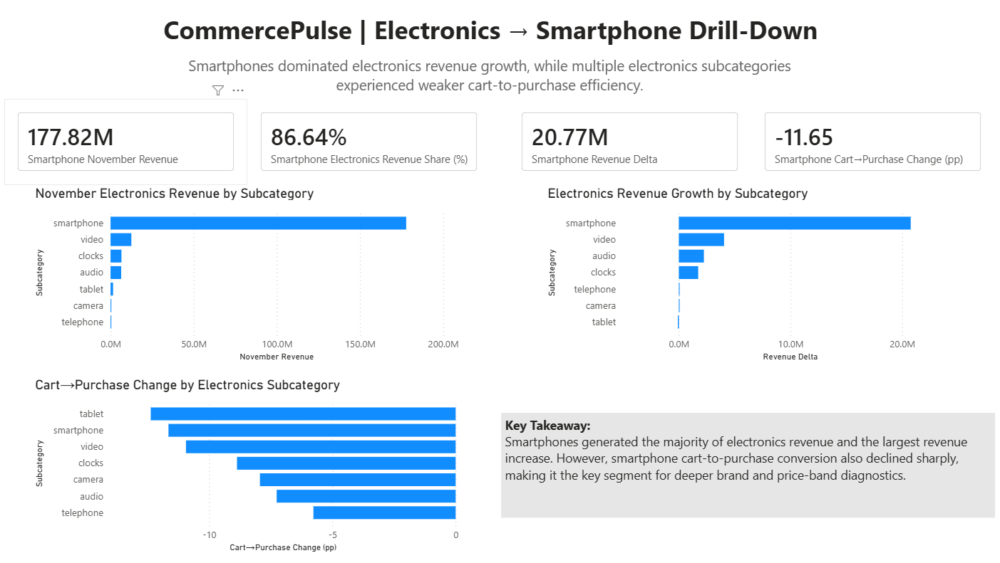
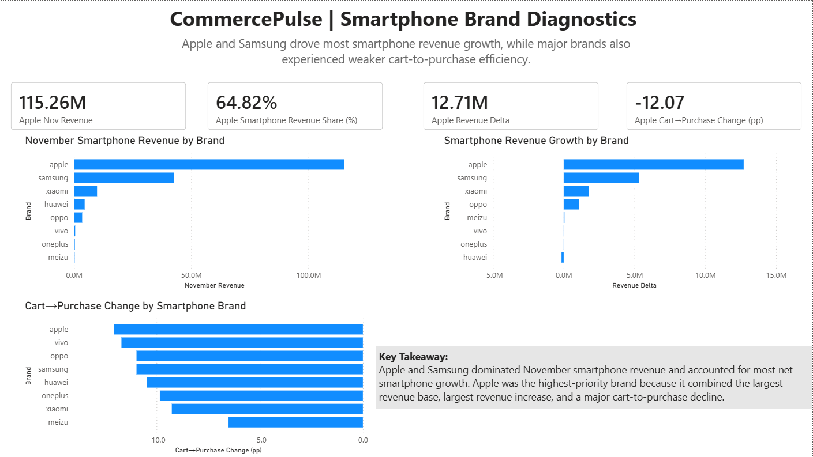
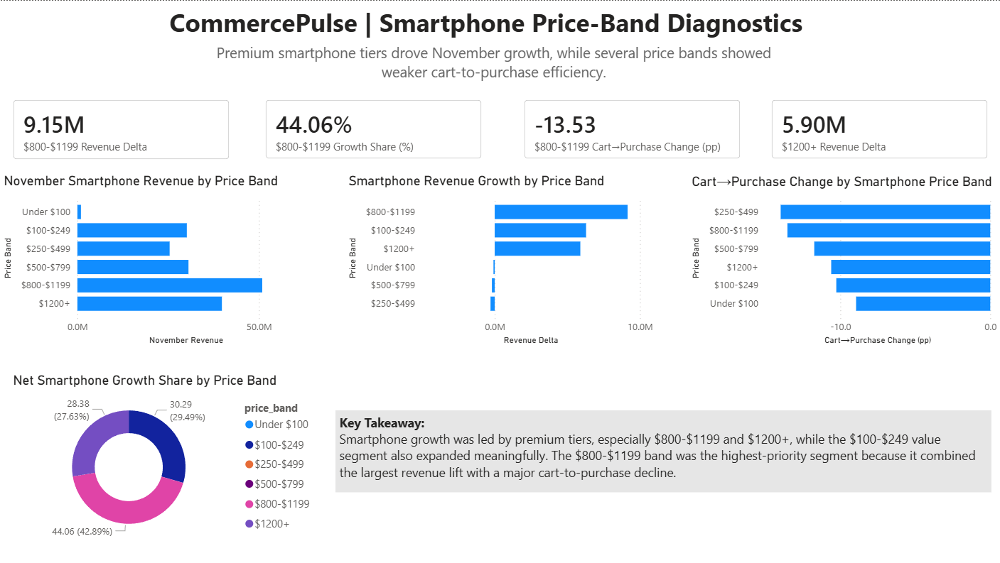
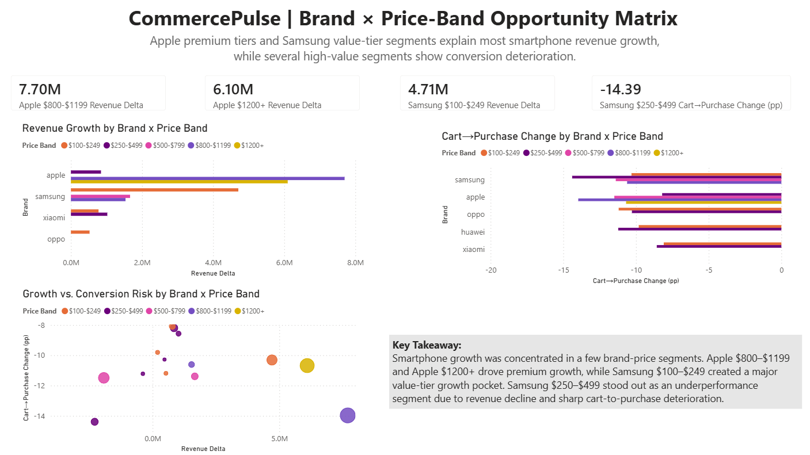

# CommercePulse: E-Commerce Product Analytics & Funnel Diagnostics

CommercePulse is an end-to-end product analytics and business intelligence project built on **109M+ e-commerce behavior events** from a multi-category online store. The project analyzes October–November 2019 customer behavior to diagnose revenue growth, funnel shifts, category performance, and smartphone segment dynamics.

The project follows a reproducible analytics engineering workflow: raw event ingestion, DuckDB-based warehouse modeling, SQL marts, diagnostic reports, and a six-page Power BI dashboard.

---

## Project Objective

November showed strong growth in platform activity and revenue, but downstream funnel quality weakened.

The main business question:

> Why did November revenue and cart activity increase while cart-to-purchase conversion declined?

To answer this, CommercePulse investigates performance across multiple levels:

```text
Platform → Category → Subcategory → Brand → Price Band → Brand × Price Band
```

---

## Key Business Findings

### Platform-Level Shift

| Metric | October 2019 | November 2019 | Change |
|---|---:|---:|---:|
| Total Events | 42.45M | 67.50M | Increased sharply |
| Active Users | 3.02M | 3.70M | Increased |
| Sessions | 9.24M | 13.78M | Increased |
| Purchase Events | 742.85K | 916.94K | Increased |
| Purchase Revenue | $229.96M | $275.19M | +19.67% |
| View → Cart Rate | 6.18% | 12.57% | +6.39 pp |
| Cart → Purchase Rate | 49.17% | 37.10% | -12.07 pp |

November generated more traffic, sessions, purchases, and revenue, but cart-to-purchase efficiency declined sharply.

---

## Final Analytical Story

```text
Platform Level
November traffic, carting, purchases, and revenue increased,
but cart-to-purchase conversion declined.

↓
Category Level
Electronics drove the largest revenue growth and showed a major conversion decline.

↓
Subcategory Level
Smartphones dominated electronics revenue and revenue growth.

↓
Brand Level
Apple and Samsung drove most smartphone expansion.

↓
Price-Band Level
Premium smartphone tiers, especially $800–$1199 and $1200+, drove major growth.

↓
Brand × Price-Band Level
Apple $800–$1199, Apple $1200+, and Samsung $100–$249 explained most smartphone revenue growth.
```

---

## Major Insights

### 1. Electronics was the largest category growth driver

Electronics added approximately **$28.79M** in month-over-month revenue growth, making it the most important category-level contributor.

However, electronics also experienced a **-11.35 percentage-point** cart-to-purchase decline, making it both a growth engine and a conversion-risk segment.

---

### 2. Smartphones dominated electronics

Within electronics, smartphones generated:

- **$177.82M** in November revenue
- **86.64%** of electronics revenue
- **$20.77M** in revenue growth
- **-11.65 pp** cart-to-purchase change

This made smartphones the most important electronics subcategory for deeper diagnostics.

---

### 3. Apple and Samsung drove most smartphone revenue

Apple and Samsung dominated November smartphone revenue.

| Brand | November Revenue | Smartphone Revenue Share | Revenue Delta | Cart → Purchase Change |
|---|---:|---:|---:|---:|
| Apple | $115.26M | 64.82% | +$12.71M | -12.07 pp |
| Samsung | $42.71M | 24.02% | +$5.34M | -10.97 pp |

Apple was the highest-priority brand because it combined the largest revenue base, largest revenue lift, and a major cart-to-purchase decline.

---

### 4. Premium smartphone tiers drove much of the growth

The **$800–$1199** price band was the most important smartphone price segment.

| Price Band | November Revenue | Revenue Delta | Net Growth Share | Cart → Purchase Change |
|---|---:|---:|---:|---:|
| $800–$1199 | $50.91M | +$9.15M | 44.06% | -13.53 pp |
| $1200+ | $39.80M | +$5.90M | 28.38% | Negative |
| $100–$249 | $30.14M | +$6.29M | 30.29% | Negative |

The $800–$1199 band combined the largest revenue lift with a major downstream conversion decline.

---

### 5. Brand × price-band analysis revealed the sharpest segments

The most important growth segments were:

| Segment | Revenue Delta | Interpretation |
|---|---:|---|
| Apple $800–$1199 | +$7.70M | Largest smartphone growth contributor |
| Apple $1200+ | +$6.10M | Major premium growth contributor |
| Samsung $100–$249 | +$4.71M | Major value-tier growth pocket |

The most important underperformance segment was:

| Segment | Signal |
|---|---|
| Samsung $250–$499 | Revenue declined and cart-to-purchase conversion deteriorated sharply |

---

## Dashboard

The Power BI dashboard contains six pages:

1. **Executive Overview**
2. **Category Growth Diagnostics**
3. **Electronics → Smartphone Drill-Down**
4. **Smartphone Brand Diagnostics**
5. **Smartphone Price-Band Diagnostics**
6. **Brand × Price-Band Opportunity Matrix**

Dashboard file:

```text
dashboards/CommercePulse_Product_Analytics.pbix
```

Dashboard PDF export:

```text
dashboards/CommercePulse_Product_Analytics_Dashboard.pdf
```

Dashboard screenshots:

```text
dashboards/screenshots/
├── 01_executive_overview.png
├── 02_category_growth.png
├── 03_electronics_drilldown.png
├── 04_brand_diagnostics.png
├── 05_price_bands.png
└── 06_brand_price_matrix.png
```

---

## Dashboard Preview

### Executive Overview



### Category Growth Diagnostics



### Electronics → Smartphone Drill-Down



### Smartphone Brand Diagnostics



### Smartphone Price-Band Diagnostics



### Brand × Price-Band Opportunity Matrix



---

## Tech Stack

| Area | Tools |
|---|---|
| Data Processing | Python, Pandas |
| Analytics Warehouse | DuckDB |
| Query Layer | SQL |
| Storage Format | Parquet, CSV |
| Reporting | Markdown |
| Dashboarding | Power BI |
| CLI Output | Rich |
| Version Control | Git, GitHub |

---

## Dataset

Dataset: **E-Commerce Behavior Data from Multi-Category Store**

Source: Kaggle / Open CDP project  
Dataset page: `https://www.kaggle.com/datasets/mkechinov/ecommerce-behavior-data-from-multi-category-store`

Raw files used:

```text
2019-Oct.csv
2019-Nov.csv
```

Cleaned events analyzed:

```text
109,950,743 rows
```

Raw data files are not committed to the repository because of file size constraints.

---

## Project Structure

```text
CommercePulse/
├── README.md
├── requirements.txt
├── .gitignore
├── src/
│   ├── data/
│   ├── warehouse/
│   └── analytics/
│       └── export_powerbi_datasets.py
├── sql/
│   ├── staging/
│   └── marts/
├── reports/
│   ├── monthly_growth_summary.md
│   ├── category_growth_diagnostics.md
│   ├── electronics_subcategory_diagnostics.md
│   ├── smartphone_brand_diagnostics.md
│   ├── smartphone_price_band_diagnostics.md
│   ├── smartphone_brand_price_band_diagnostics.md
│   └── final_business_insights.md
├── docs/
│   ├── project_summary.md
│   ├── dashboard_walkthrough.md
│   └── data_dictionary.md
└── dashboards/
    ├── data/
    ├── screenshots/
    └── CommercePulse_Product_Analytics_Dashboard.pdf
```

---

## Reproducibility

### 1. Create and activate environment

```powershell
python -m venv .venv
.venv\Scripts\activate
```

Install dependencies:

```powershell
pip install duckdb pandas pyarrow rich
```

---

### 2. Place raw data files

Download the October and November CSV files and place them in:

```text
data/raw/
```

Expected files:

```text
data/raw/2019-Oct.csv
data/raw/2019-Nov.csv
```

---

### 3. Prepare cleaned event data

```powershell
python src\data\prepare_events.py --overwrite
```

This converts raw CSV event data into cleaned Parquet files.

---

### 4. Profile cleaned data

```powershell
python src\data\profile_clean_events.py
```

Expected cleaned dataset profile:

```text
Total rows: 109,950,743
Unique users: 5,316,649
Unique sessions: 23,016,650
Unique products: 206,876
Unique categories: 691
Unique brands: 4,303
```

---

### 5. Build DuckDB warehouse

```powershell
python src\warehouse\build_warehouse.py --overwrite
```

This creates the staging view and all analytical marts.

---

### 6. Generate analytical reports

```powershell
python src\analytics\generate_monthly_kpi_report.py
python src\analytics\generate_category_diagnostics_report.py
python src\analytics\generate_electronics_subcategory_report.py
python src\analytics\generate_smartphone_brand_report.py
python src\analytics\generate_smartphone_price_band_report.py
python src\analytics\generate_smartphone_brand_price_band_report.py
```

---

### 7. Export Power BI datasets

```powershell
python src\analytics\export_powerbi_datasets.py
```

This exports dashboard-ready CSV files to:

```text
dashboards/data/
```

---

## Final Warehouse Marts

| Mart | Purpose |
|---|---|
| `mart_monthly_kpis` | Platform-level monthly KPIs |
| `mart_monthly_category_performance` | Category-level monthly performance |
| `mart_category_mom_diagnostics` | Category month-over-month diagnostics |
| `mart_monthly_subcategory_performance` | Subcategory monthly performance |
| `mart_electronics_subcategory_mom_diagnostics` | Electronics subcategory diagnostics |
| `mart_monthly_smartphone_brand_performance` | Smartphone brand monthly performance |
| `mart_smartphone_brand_mom_diagnostics` | Smartphone brand diagnostics |
| `mart_monthly_smartphone_price_band_performance` | Smartphone price-band monthly performance |
| `mart_smartphone_price_band_mom_diagnostics` | Smartphone price-band diagnostics |
| `mart_monthly_smartphone_brand_price_band_performance` | Brand × price-band monthly performance |
| `mart_smartphone_brand_price_band_mom_diagnostics` | Brand × price-band diagnostics |

---

## Dashboard Data Exports

Power BI uses the following exported CSV files:

```text
dashboards/data/
├── monthly_kpis.csv
├── monthly_category_performance.csv
├── category_mom_diagnostics.csv
├── electronics_subcategory_mom_diagnostics.csv
├── smartphone_brand_mom_diagnostics.csv
├── smartphone_price_band_mom_diagnostics.csv
└── smartphone_brand_price_band_mom_diagnostics.csv
```

---

## Metric Definitions

### Purchase Revenue

Sum of `price` for purchase events.

### Revenue Delta

```text
November Purchase Revenue - October Purchase Revenue
```

### Revenue Growth %

```text
Revenue Delta / October Purchase Revenue
```

### Cart-to-Purchase Change pp

```text
November Cart-to-Purchase Rate - October Cart-to-Purchase Rate
```

The unit is percentage points.

### Net Smartphone Revenue Growth Share %

```text
Segment Revenue Delta / Total Net Smartphone Revenue Delta
```

Positive growth shares can sum to more than 100% when some segments have negative revenue deltas.

### Unknown Category / Brand

Rows with missing metadata are retained as `unknown` rather than dropped to preserve transparency and avoid hiding financially material uncategorized activity.

---
